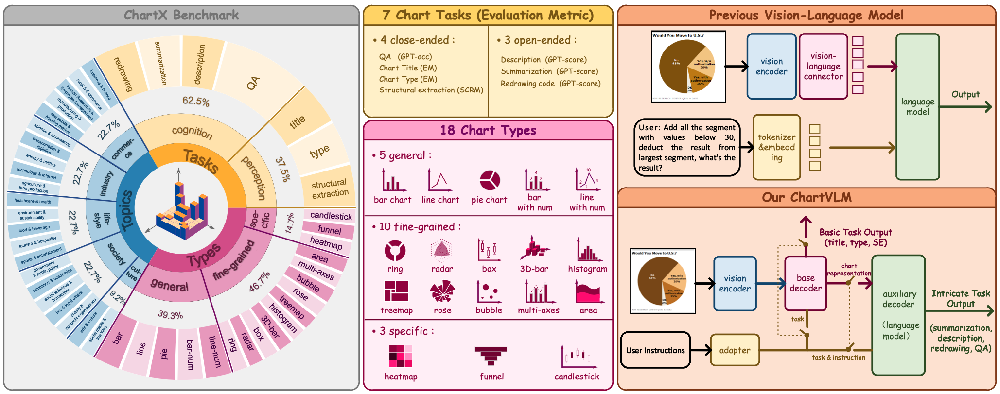
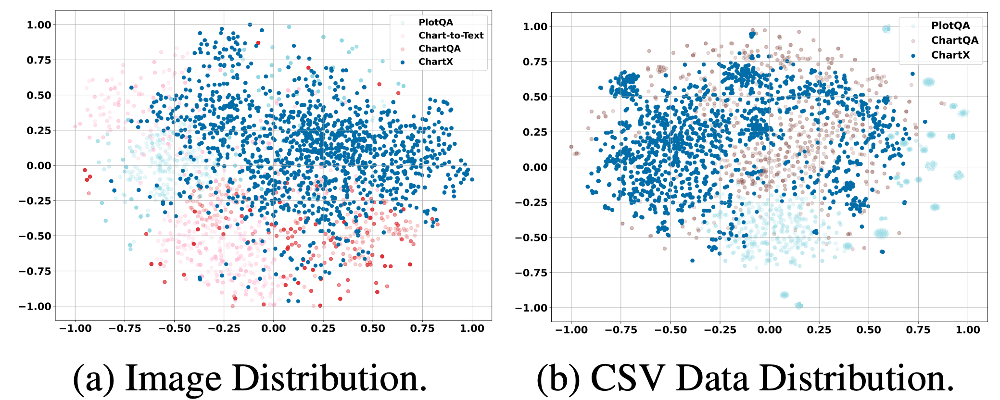
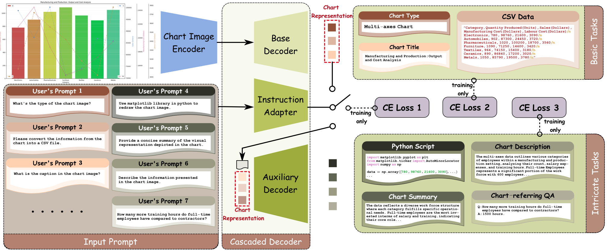
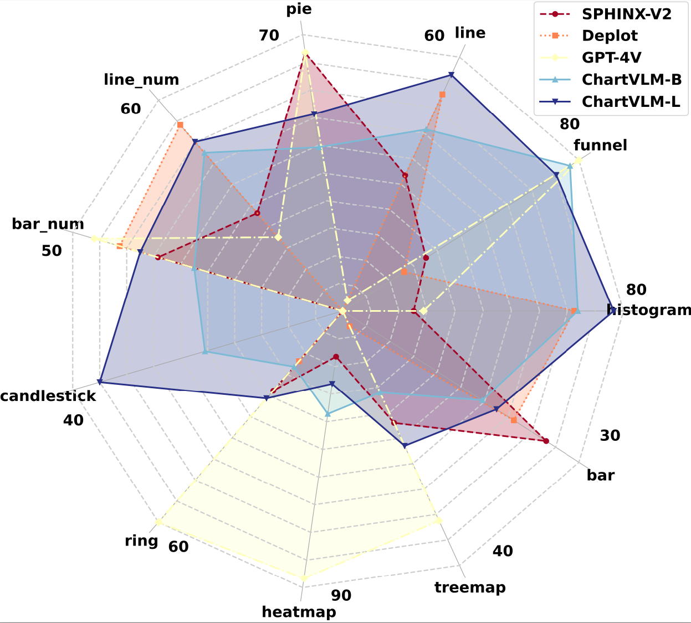
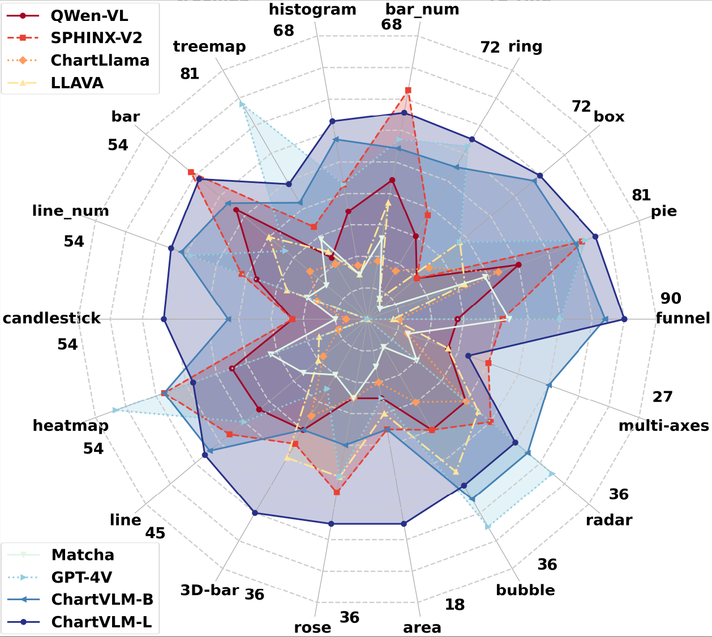
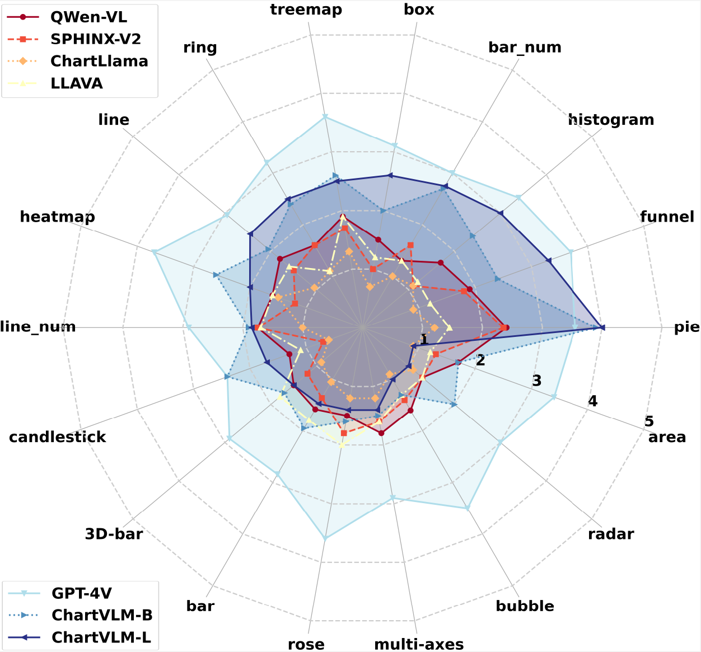
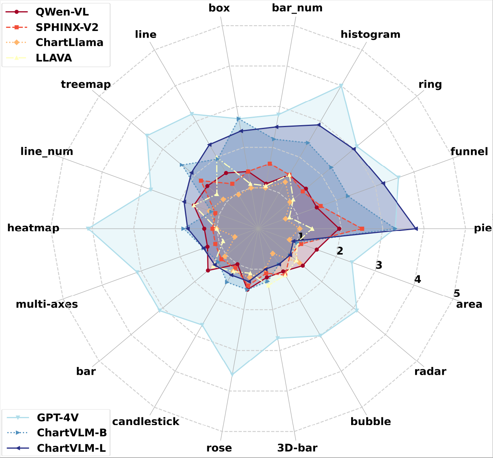

[](https://arxiv.org/abs/2402.12185)
[](https://github.com/UniModal4Reasoning/ChartVLM/issues)
[](https://github.com/UniModal4Reasoning/ChartVLM/pulls)


# ChartX & ChartVLM
Recently, many versatile Multi-modal Large Language Models (MLLMs) have emerged continuously. However, their capacity to query information depicted in visual charts and engage in reasoning based on the queried contents remains under-explored. In this paper, to comprehensively and rigorously benchmark the ability of the off-the-shelf MLLMs in the chart domain, we construct ChartX, a multi-modal evaluation set covering 18 chart types, 7 chart tasks, 22 disciplinary topics, and high-quality chart data. Besides, we develop ChartVLM to offer a new perspective on handling multi-modal tasks that strongly depend on interpretable patterns such as reasoning tasks in the field of charts or geometric images. We evaluate the chart-related ability of mainstream MLLMs and our ChartVLM on the proposed ChartX evaluation set. Extensive experiments demonstrate that ChartVLM surpasses both versatile and chart-related large models, achieving results comparable to GPT-4V. We believe that our study can pave the way for further exploration in creating a more comprehensive chart evaluation set and developing more interpretable multi-modal models.


<div align=center>

</div>

------------------------

<div align="center">
<h1>ChartX Evaluation Set<br></h1>
</div>

## Overall
We collected 48K multi-modal chart data covering **22 topics**, **18 chart types**, and **7 tasks**. Each chart data within this dataset includes four modalities: image, CSV, python code, and text description. 
 

<details>
<summary> 18 chart types:</summary>

General Chart Types = ['bar chart', 'bar_num chart', 'line chart', 'line_num chart', 'pie chart'],

Fine-grained Chart Types = ['radar chart', 'histogram', 'box plot', 'treemap', 'bubble chart', 'area chart', '3D-bar chart', 'multi-axes', 'ring chart', 'rose chart'],

Domain-specific Chart Types=['heatmap', 'candlestick chart', 'funnel chart']

</details>

<details>
<summary> 22 chart topics:</summary>

major_categories = [
"Business and Finance",
"Healthcare and Health",
"Science and Engineering",
"Social Media and the Web",
"Government and Public Policy",
"Education and Academics",
"Environment and Sustainability",
"Arts and Culture",
"Retail and E-commerce",
"Tourism and Hospitality",
"Human Resources and Employee Management",
"Agriculture and Food Production",
"Energy and Utilities",
"Transportation and Logistics",
"Real Estate and Housing Market",
"Manufacturing and Production",
"Sports and Entertainment",
"Social Sciences and Humanities",
"Law and Legal Affairs",
"Technology and the Internet",
"Charity and Nonprofit Organizations",
"Food and Beverage Industry"
]

</details>

<details>
<summary> 7 chart tasks (Employed eval metric):</summary>

4 close-ended = ['Structural Extraction (SCRM)', 'Chart Type (EM)', 'Chart Title (EM)', 'QA (GPT-acc)']

3 open-ended = ['Description (GPT-score)', 'Summarization (GPT-score)', 'Redrawing code (GPT-score)']

</details>

## ChartX Download

<details>
<summary> Data Download</summary>

Please download the official [ChartX Evaluation Set](https://drive.google.com/file/d/1d6zyH3kIwgepTqR0fc67xzyUtblrvOIX/view?usp=sharing) dataset and organize the downloaded files as follows:
```
ChartX
├── 3D-Bar
│   ├── code
|   ├── csv
|   ├── png
|   ├── txt
├── area_chart
│   ├── code
|   ├── csv
|   ├── png
|   ├── txt
....
....
├── rose
│   ├── code
|   ├── csv
|   ├── png
|   ├── txt
```
</details>


<details>
<summary> Visualization of Data Distribution</summary>

<div align=center>

</div>

</details>


------------------------

<div align="center">
<h1>ChartVLM<br></h1>
</div>

## ChartVLM Overall: 
- **(1)** To enhance the interpretability of the chart model in cognition tasks (e.g. answer questions based on chart image), ChartVLM first performs the base perception task (e.g. structural extraction from the given chart image to a predicted CSV data), and then, finishes other cognition tasks (e.g. chart redrawing, description, summary, and QA) based on the extracted structural data. 
- **(2)** To choose the task that users expect to perform according to the used prompts, the instruction adapter is designed, which can cover a variety of user instructions as illustrated in this figure.

<div align=center>

</div>


## Installation for ChartVLM
* Clone this repository.
    ```shell
    git clone https://github.com/UniModal4Reasoning/ChartVLM.git
    ```
* Install the python dependent libraries.
    ```shell
    pip install -r requirements.txt 
    ```

## Pre-trained Checkpoints of ChartVLM
Please refer to Huggingface to download our pre-trained weights for [ChartVLM-large](https://huggingface.co/U4R/ChartVLM-large) and [ChartVLM-base](https://huggingface.co/U4R/ChartVLM-base).

<details>
<summary>You need to organize the downloaded ckpts as follow:</summary>

```
CharVLM-base (or your customized name)
├── instruction_adapter
│   ├── mlp_classifier.pth
|   ├── vectorizer.pkl
├── base_decoder
│   ├── type_title
│   │   ├── files of type_title base_decoder
│   ├── files of base_decoder
├── auxiliary_decoder
│   ├── base
│   │   ├── files of pretrained auxiliary_decoder
│   ├── files of auxiliary_decoder lora_weights 
```
</details>

## Training ChartVLM
Please refer to [instruction adapter](adapter/README.md), [base decoder](base_decoder/README.md), and [auxiliary decoder](auxiliary_decoder/README.md) for more details of model training.

## Evaluation
Please refer to [eval](eval/README.md) for details of evaluation all tasks


<details>
<summary> Evaluation Results for Structural Extraction (SE) task</summary>

<div align=center>

</div>

</details>


<details>
<summary> Evaluation Results for QA task</summary>

<div align=center>

</div>

</details>


<details>
<summary> Evaluation Results for Description task</summary>

<div align=center>

</div>

</details>


<details>
<summary> Evaluation Results for Summarization task</summary>

<div align=center>

</div>

</details>
